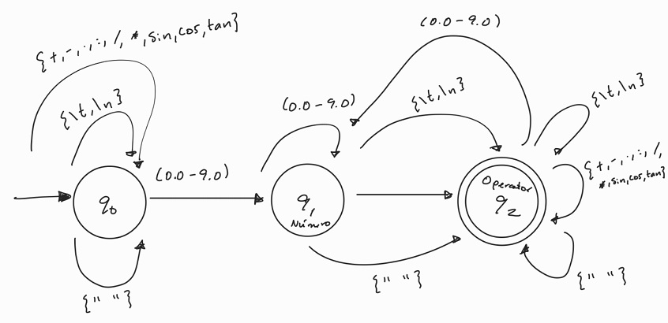
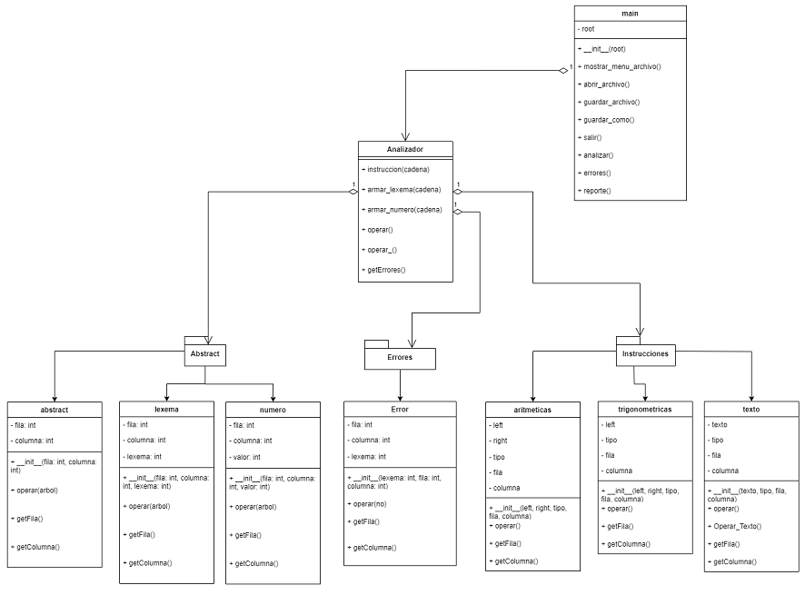

                
 

#### Universidad de San Carlos de Guatemala
#### Facultad de Ingenieria
#### Escuela de Ciencias y Sistemas

---
---

# Manual Técnico
# Software - Analizador Léxico

---

Edison Mauricio García Rodríguez

202200031

Laboratorio de Lenguajes Formales y Programación A-

Aux: Enrique Pinula

---
---

## Introducción 

A continuación se detallan las características técnicas del software de Analizador Léxico, tanto como el lenguaje de programación y herramientas utlizadas para el desarrollo de este software.

## Requerimientos del Sistema
### Sotware

* Python: Lenguaje de programación utilizado para la elaboración del Analizador Léxico, en su versión Python 3.11.1. En dado caso, no se tiene instalado, se puede obtener en [Descargar Python](https://www.python.org/downloads/ "Python")

* Graphviz: Software implementado para la representación de datos de manera gráfica.  [Descargar Graphviz](https://graphviz.org/download/ "Graphviz")

### Librerías

* Tkinter: Se implementó la librería de Tkinter para el entorno visual del software del Analizador Léxico, esta es una librería propia de Python por lo que no se debe instalar nada respecto a Tkinter, únicamente importar la librería al momento de hacer uso de esta.

* Graphviz: Es un software de código abierto para representar gráficamente estructuras de datos, diagramas de flujo, redes, diagramas UML, entre otros.  Para efectos de este software se implementó Graphviz, para generar la gráfica de las operaciones y resultados contenidas en el archivo .json, previamente cargado de manera correcta.

## Funcionalidad

El software del Analizador Léxico es capaz de realizar un análisis al archivo .json, posterior a ello se genera un reporte de errores y se genera una gráfica, todo esto se desarrolla a través de un entorno visual de manera gráfica, usando la librería **Tkinter** para implementar interfaces gráficas.

## Lógica del Software

### Algoritmo Operaciones
El software de Analizador Léxico reconoce varias operaciones como:

    * SUMA
    * RESTA
    * MULTIPLICACIÓN
    * DIVISIÓN
    * POTENCIA
    * RAIZ
    * INVERSO
    * SENO
    * COSENO
    * TANGENTE
    * MOD 

Cada una de estas, pueden anidar más operaciones esto se logra a través de evaluar si al final de un valor viene una (,) esto indica al sistema que las operaciones vienen anidadas o que tiene más de un valor.

A continuación se muestra una porción de código donde se reconoce si el tipo de operación es Aritmética o Trigonométrica:

* Aritmética

```Python
    def operar(self, arbol):
        leftValue = ''
        rightValue = ''
        if self.left != None:
            leftValue = self.left.operar(arbol)
        if self.right != None:
            rightValue = self.right.operar(arbol)    

        operacion = self.tipo.operar(arbol)

        if operacion == 'Suma' or operacion == 'suma':
            resultados = round(leftValue + rightValue,2)
            return resultados
        elif operacion == 'Resta' or operacion == 'resta':
            resultados = round(leftValue - rightValue,2)
            return resultados
        elif operacion == 'Multiplicacion' or operacion == 'multiplicacion':
            resultados = round(leftValue * rightValue,2)
            return resultados
        elif operacion == 'Division' or operacion == 'division':
            resultados = round(leftValue / rightValue,2)
            return resultados
        elif operacion == 'Potencia' or operacion == 'potencia':
            resultados = round(leftValue ** rightValue,2)
            return resultados
        elif operacion == 'Raiz' or operacion == 'raiz':
            resultados = round(leftValue ** (1/rightValue),2)
            return resultados
        elif operacion == 'Mod' or operacion == 'mod':
            resultados = round(leftValue % rightValue,2)
            return resultados
        else:
            return None
```

* Trigonométrica:

```Python
    def operar(self, arbol):
        leftValue = ''
        if self.left != None:
            leftValue = self.left.operar(arbol)

        operacion = self.tipo.operar(arbol)

        if operacion == 'Inverso' or operacion == 'inverso':
            resultados = round(1/leftValue,2)
            return resultados
        elif operacion == 'Seno' or operacion == 'seno':
            resultados = round(sin(radians(leftValue)), 2)
            return resultados
        elif operacion == 'Coseno' or operacion == 'coseno':
            resultados = round(cos(radians(leftValue)), 2)
            return resultados
        elif operacion == 'Tangente' or operacion == 'tangente':
            resultados = round(tan(radians(leftValue)), 2)
            return resultados
        else:
            return None    
```


### Estructura del AFD 

* Estados:
    * Q = {q0, q1, q2}
    * Σ = {0.0 - 9.0}

    Donde: 

        q0 = Estado Inicial

        q1 = Estado de Reconocer Número

        q2 = Estado de Reconocer Operador

* Tabla de Transiciones:

    | Estado   | (0.0 - 9.0)   | (+,-,*,/, sin, cos, tan)   | " " (Espacio en blanco)  | (\t, \n) Otro caracter |
    |:--------:|:-------------:|:--------------------------:|:------------------------:|:----------------------:|
    | q0       | q0            | q0                         | q0                       | q0                     |
    | q1       | q1            | q2                         | q2                       | q2                     |
    | q2       | q1            | q2                         | q2                       | q2                     |


### Diagrama AFD - Analizador Léxico
Se adjunta diagrama del Autómata Finito Determinista el cual se implementó en el desarrollo del software de Analizador Léxico.



## Diagrama de Clases
De igual manera se adjunta el diagrama de clases del Analizador Léxico, para una mejor comprensión sobre la estructura de este software.


