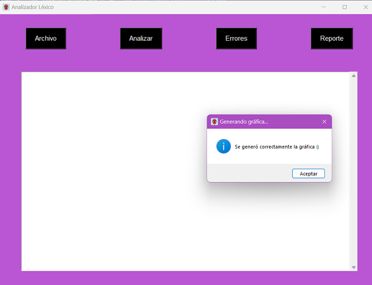

                
 

#### Universidad de San Carlos de Guatemala
#### Facultad de Ingenieria
#### Escuela de Ciencias y Sistemas

---
---

# Manual de Usuario
# Software - Analizador Léxico

---

Edison Mauricio García Rodríguez

202200031

Laboratorio de Lenguajes Formales y Programación A-

Aux: Enrique Pinula

---
---

## Introducción 

El software de Analizador Léxico fue desarrollado mediante el lenguaje de programación Python, este recibe como archivo de entrada un archivo con extensión .json, posterior a ello se realiza el análisis del archivo y se generan los resultados de las operaciones que contiene dicho archivo, luego se genera un reporte de los errores que contiene el archivo, el sistema valida si contiene errores y de encontrar alguno, se genera el reporte antes mencionado y por último se tiene la opción de Reporte, en donde se muestra la gráfica de todas las operaciones que contiene el archivo .json, de igual manera en el cuadro de texto se puede manipular dicho archivo, previamente cargado el archivo, una vez cargado el archivo se habilitan las opciones de guardar y guardar como, esto para mejorar la interacción del software con el usuario.

## Características
### A. Ventana Principal
A continuación se muestra una imagen donde se puede visualizar el entorno de la interfaz del software del Analizador Léxico:

### B. Archivo
El botón **Archivo** nos permite desplegar funciones como:
* **Abrir:** Permite abrir un archivo .json y cargar los datos en el cuadro de texto.

* **Guardar:** Esta función nos permite guardar cualquier cambio realizado en el archivo actual, en este caso el archivo en el que estamos trabajando.

* **Guardar Como:** Al momento de seleccionar esta opción nos permite exportar el archivo actual a uno con extención .json.

* **Salir:** Por último se agrega la opción salir, que al momento de confirmar que deseamos salir del programa, automáticamente finalizará la ejecución del mismo.

### C. Analizar
El botón **Analizar** nos permite realizar un análisis en base a los datos contenidos dentro del archivo .json previamente cargado en el cuadro de texto, esta opción nos permite generar los resultados de las operaciones y mostrarlos al usuario.

### D. Errores
El botón **Errores** nos permite generar un reporte de los errores obtenidos del archivo .json previamente cargado en el cuadro de texto, generando una notificación al usuario sobre los errores obtenidos y de igual manera genera un archivo .txt con los errores obtenidos.

### E. Reporte
El botón **Reporte** nos permitirá obtener una gráfica con todas las operaciones del archivo .json y los resultados previamente analizado dicho archivo. Este gráfico lo podremos encontrar en la carpeta donde se encuentra el código fuente.

